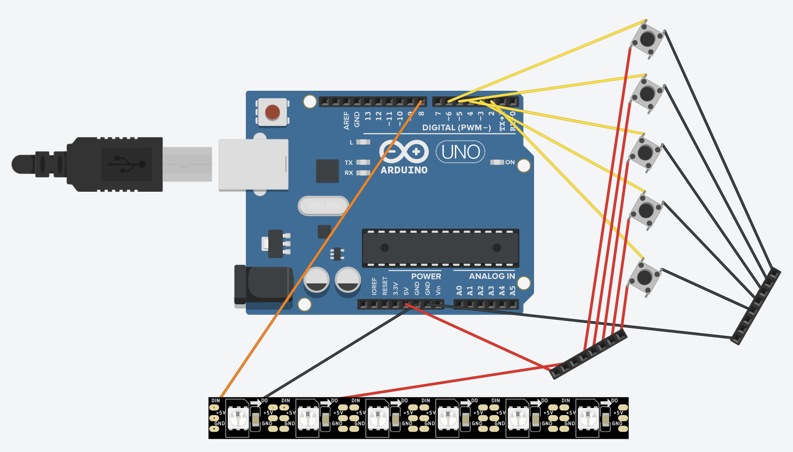
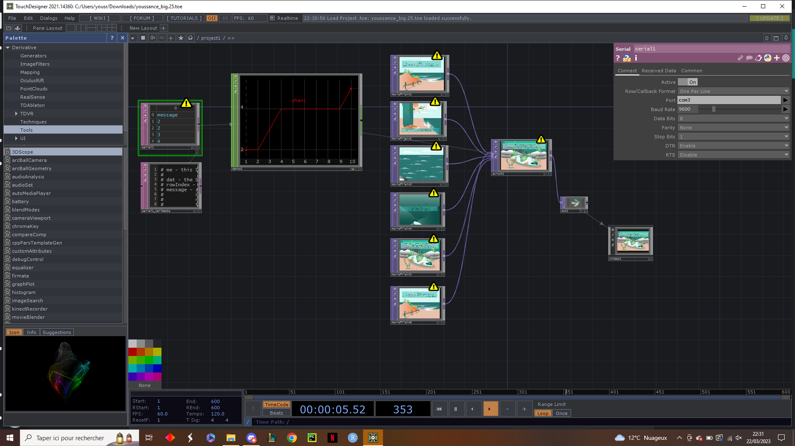

# Le peuple des profondeurs

## Projet Encre 🐋⚰️

### Participants :
* Ingénieurs ([Polytech Nantes](https://polytech.univ-nantes.fr/)) :
  * [Corentin Banier](https://github.com/cbanier/)
  * [Omar Jeridi](https://github.com/JeridiOmar/)
  * Yousri Lajnef
  
* Designers ([L'École de design Nantes Atlantique](https://lecolededesign.com/fr)) :
  * Aurélien Bourdet
  * Enora Jaffre
  * Kateline Jaslier
  * Jianing Leguen
  * Pauline Pedel
  * Charles Podo

### Technologies :
* Carte Arduino
* TouchDesigner
* Librairie FastLED

### Maquette électronique :
Le fichier ```/doc/ArduinoModel.pdf``` représente le circuit électronique détaillé du projet.

<ins>Voici une version simplifiée de la maquette :</ins>

<em>Remarque : La maquette ci-dessus ne mentionne pas le condensateur qui est utilisé pour le ruban de LED.</em>

### Code source :
Le code source figure dans le fichier ```/src/encre.c```.
Le fichier est commenté afin d'en comprendre son fonctionnement.

### Librairie FastLED :
Le fichier ```/src/colorpalettes.cpp``` doit remplacé le fichier initial ```colorpalettes.cpp``` présent dans le code source de la librairie FastLED.

### TouchDesigner :
Le fichier ```/src/encre_screen_switcher.toe``` est l'archive du projet TouchDesigner.



<em>Remarque : TouchDesigner lit la sortie standard de la carte Arduino, d'où les ```Serial.println()``` dans le code source.</em>