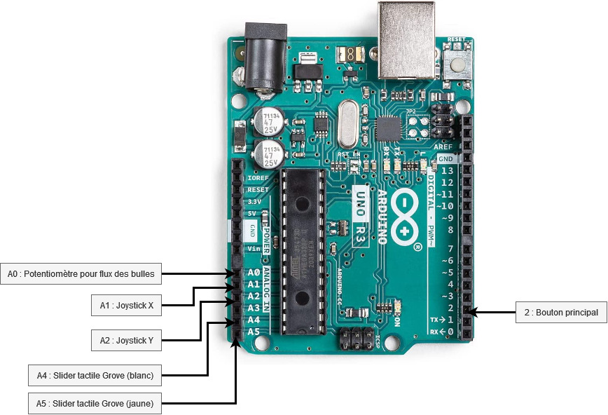

# Harmopha

## L'équipe

### Polytech

- Corentin Gouil - [@CorentinGouil](https://github.com/CorentinGouil)
- Carla Maciejski - [@moonevar](https://github.com/moonevar)
- Chenrui Zhu - [@Chenrui-ZHU](https://github.com/Chenrui-ZHU)

### EDNA

- Justin Auger
- Julien Cormier
- Axel Giboulot
- Aliza Leb
- Mado Millet
- Tristan Picaud
- Thomas Pichery

## Thématique

- Quelques mots sur la thématique abordée et comment elle a été traitée

## Guide d'installation et de lancement du projet

- A vous de jouer !

### Prérequis logiciels
- Unity
- Arduino IDE

### Prérequis materielle
- Arduino Uno
- Potentiomètre (pour le flux de bulle)
- Joystick (pour la navigation dans les menus)
- Bouton
- Slider tactile Grove

### Arduino

Le lien entre les commandes physiques de l'installation et le jeu se fait par le biais d'un contrôleur Arduino.

#### Branchement

Les câblages en terme d'alimentation sont basiques, et sont donc exclus des schémas pour favoriser la lisibilité.

Le schéma suivant reprend le branchement des commandes sur la carte Arduino.

Pour l'Arduino qui s'occupe des LEDs, il suffit de brancher le contrôleur de la LED (câble central) sur n'importe quel pin digital (à droite du schéma, comme pour le bouton).

#### Librairie

Le code source Arduino utilise différentes librairies qu'il faudra installer dans Arduino IDE avant la compilation.

Il s'agit de :
- [ArduinoJson](https://arduinojson.org/?utm_source=meta&utm_medium=library.properties)
- [Grove](https://github.com/Seeed-Studio/Grove_touch_sensor_CY8C40XX)
- [FastLED](https://github.com/FastLED/FastLED)

#### Compilation

Le code source de l'Arduino servant aux commandes physique se trouve dans `/Assets/arduino_unity/arduino_unity.ino`.

Le code source de l'Arduino servant aux LED se trouve dans `/Assets/arduino_unity/led_background/led_background.ino`.

Il faut l'ouvrir avec `Arduino IDE` pour pouvoir compiler le code source et le déployer sur la carte Arduino.
Pensez à bien sélectionner la bonne carte Arduino avant de faire Upload.

### Unity

Le projet Unity est conçu pour être prêt à l'usage sans manipulation particulière.

Pour créer un exécutable, il faut ouvrir le projet sur Unity puis compiler celui-ci (File > Build and Run).

La connexion avec la carte Arduino pour les commandes se fait automatiquement si celle-ci est connecté en USB à l'ordinateur et que le programme de celle-ci est en cours d'exécution.

